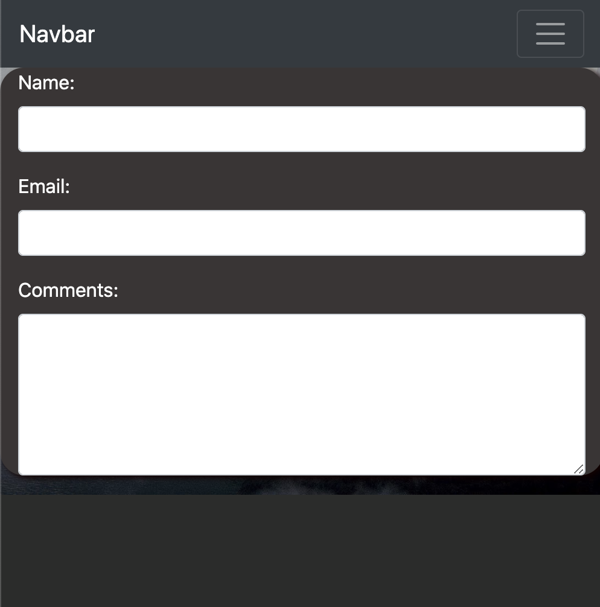
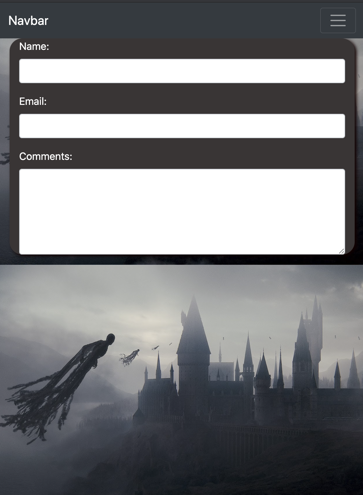
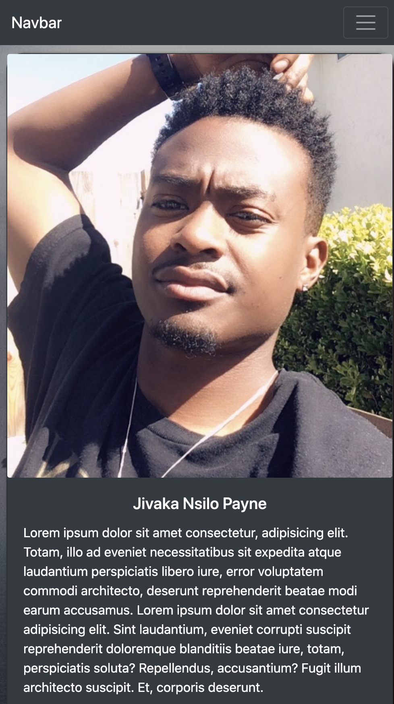
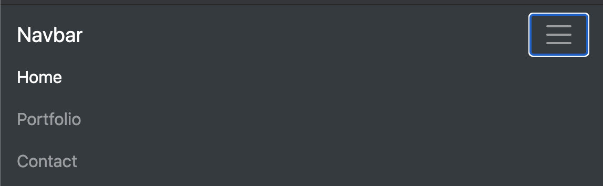
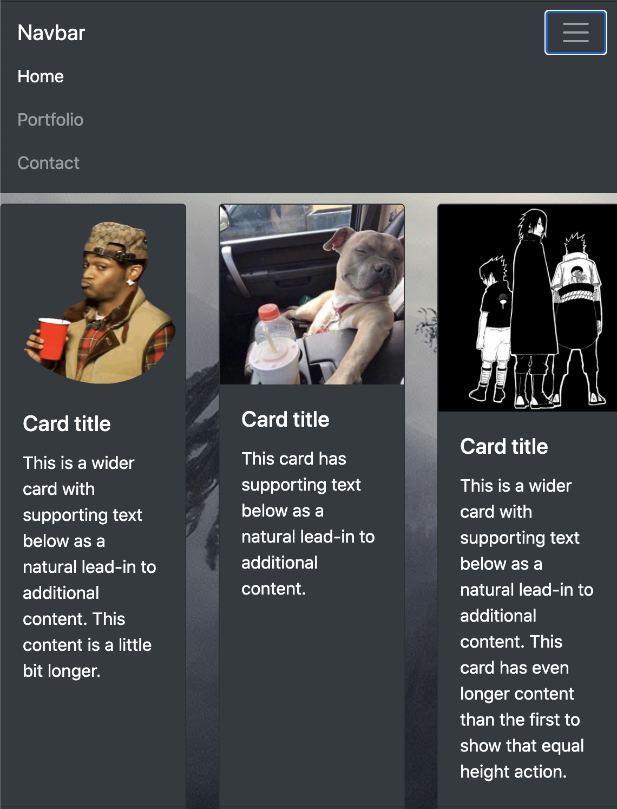
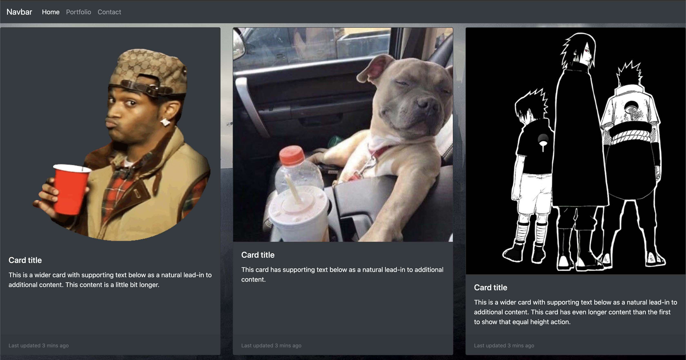
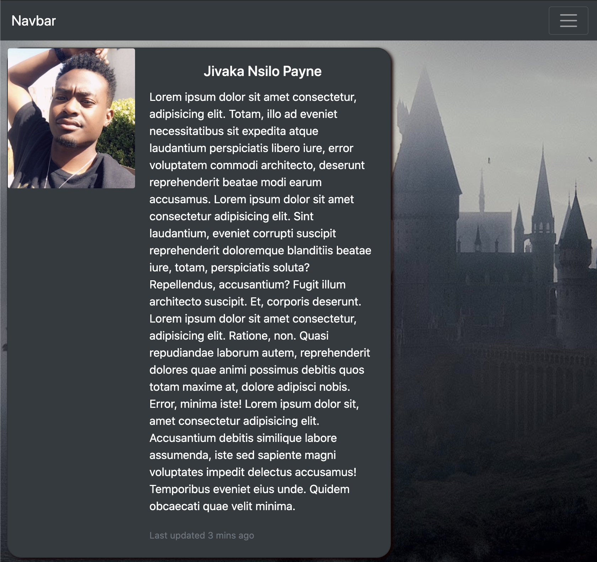

# Unit 02 CSS and Bootstrap Homework: Responsive Portfolio

* added nav bar and linked all the html

* added images to my card and portfolio

* linked all outsourced css and my own css

* finished contact page

* added some shadows and rounding

